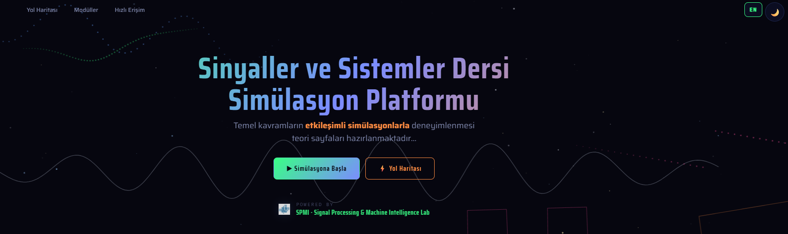

<div align="center">

<p align="center">
  
</p>

<!-- Gabor wavelet SVG (Gaussian-modulated cosine) — sinyal temalı başlık ikonu -->
<svg xmlns="http://www.w3.org/2000/svg" width="44" height="44" viewBox="0 0 120 60" fill="none" aria-hidden="true">
  <defs>
    <linearGradient id="g" x1="0%" y1="0%" x2="100%" y2="0%">
      <stop offset="0%"  stop-color="#39ff85"/>
      <stop offset="50%" stop-color="#7b8cff"/>
      <stop offset="100%" stop-color="#ff8c42"/>
    </linearGradient>
  </defs>
  <path d="M2 30
           C 10 30, 12 30, 14 24
           C 16 18, 18  6, 22 30
           C 26 54, 30 42, 34 12
           C 38 -6, 42 60, 46 30
           C 50  0, 54 54, 58 30
           C 62  8, 66 50, 70 30
           C 74 14, 78 42, 82 30
           C 86 22, 90 36, 94 30
           C 98 26, 102 30, 118 30"
        stroke="url(#g)" stroke-width="2.6" stroke-linecap="round" stroke-linejoin="round"/>
</svg>

# Sinyaller ve Sistemler &nbsp;—&nbsp; Simülasyon Platformu
### *Signals & Systems — Simulation Platform*

[](https://github.com/spmi-lab)
[](LICENSE)
[]()
[](https://katex.org/)
[]()

[**TR — Türkçe**](#tr--türkçe) · [**EN — English**](#en--english)

https://spmi-lab.github.io/signal_sim/tr/index.html


</div>

---

<a id="tr--türkçe"></a>
## TR — Türkçe

### Tanıtım

Bu açık kaynak çalışma, lisans seviyesindeki **Sinyaller ve Sistemler**
dersinin temel matematiksel yapı taşlarını — *konvolüsyon, Fourier
serisi ve dönüşümü, Laplace dönüşümü, örnekleme teoremi, Z-dönüşümü,
DTFT/DFT/FFT* — tarayıcıda anlık tepki veren **16 etkileşimli simülasyon**
aracılığıyla görselleştirmektedir. Platform Türkçe ve İngilizce olmak üzere 
iki dilde sunulmakta, tüm matematiksel ifadeler KaTeX ile dizgilenmiştir.

Platform geliştirmeye açıktır; mevcut altyapı üzerine yeni eklemeler
yapılabilir ve buradaki yapı taşları kullanılarak yeni projeler
geliştirilebilir.

> **Önemli Not.** Kaynak kodun önemli bir bölümü büyük
> dil modeli (LLM) destekli kod üretim araçları ile geliştirilmiş ve
> ardından detaylıca gözden geçirilerek düzenlenmiştir.
> Tüm denetimlere karşın küçük matematiksel, terminolojik, dil yapısı
> veya uygulama düzeyinde tutarsızlıklar bulunabilir.   
 
### 𝓕 Simülasyon Kataloğu

#### ∫ Sürekli Zaman (5)
- **Temel Sinyaller** — δ(t), u(t), eᵃᵗ, cos(Ωt)
- **LTI Sistem Özellikleri** — Doğrusallık · Zamanla değişmezlik · Nedensellik · Kararlılık
- **Sürekli Zamanda Konvolüsyon** — y(t) = ∫ x(τ)h(t−τ)dτ
- **Fourier Serisi** — Periyodik sinyallerin harmonik ayrışımı
- **Laplace Dönüşümü** — 3B s-düzlemi, kutup-sıfır analizi

#### Σ Ayrık Zaman (5)
- **Ayrık Zamanda Konvolüsyon** — y[n] = Σₖ x[k]h[n−k]
- **Örnekleme Teoremi ve Örtüşme (Aliasing)** — Nyquist kriteri
- **Ayrık Zaman Fourier Dönüşümü (DTFT)** — Birim çember, 2π-periyodiklik
- **Ayrık Fourier Dönüşümü (DFT/FFT)** — Pencereleme, sızıntı, hız analizi
- **Z-Dönüşümü** — 3B z-düzlemi, ROC, kutup-sıfır yerleşimi

#### ★ Uygulama Simülasyonları (6)
- **Radyo: Frekans Bölmeli Çoğullama** — AM/FM/QAM/OFDM çekirdeği
- **Gerçek Zamanlı STFT** — 8 pencere fonksiyonu, overlap denetimi
- **Ayrık Kosinüs Dönüşümü (DCT)** — JPEG'in matematik temeli
- **Hilbert-Huang Dönüşümü (HHT/EMD)** — Anlık frekans analizi
- **Doppler Radarı ile Hız Tespiti** — SNR, MTI filtreleme, FFT spektrumu
- **Kesirli Fourier Dönüşümü (FrFT)** — İnce mercek optik analojisi

### ▶ Kısa Tanıtım Videoları

Her simülasyonun nasıl çalıştığını gösteren kısa tanıtım videoları
hazırlanmıştır. Erişim, her simülasyon sayfasının
üstünde yer alan ▶ üzerinden sağlanmaktadır.

### Çalıştırma

```bash
git clone https://github.com/spmi-lab/<repo>.git
cd <repo>/ss_sim
python -m http.server 8000
# veya
npx serve
```

Tarayıcıda `http://localhost:8000` adresi açılır. Dil tercihi
`localStorage` üzerinden hatırlanır.

> Mikrofon ya da ses girişi gerektiren simülasyonların çalışabilmesi
> için sayfanın HTTPS veya `localhost` üzerinden sunulması gerekir
> (tarayıcı `getUserMedia` kısıtlaması).

### Teknoloji Yığını

- **Vanilla JavaScript** — derleme adımı / bağımlılık yok
- **KaTeX** — matematik dizgisi
- **Canvas 2D / WebGL** — etkileşimli görselleştirme
- **Web Audio API** — ses ve STFT analizi

### Esinlenilen Çalışmalar

Görsel-etkileşimli matematik anlatımı geleneğine ait şu çalışmadan
esinlenilmiştir:

- **Jez Swanson — *An Interactive Introduction to Fourier Transforms***
  <https://www.jezzamon.com/fourier/tr.html>

### 🎵 Tanıtım Videolarındaki Müzik — Sanatçı Kredileri

Tanıtım videolarında aşağıdaki sanatçıların eserlerinden yararlanılmıştır. 

- **Erkan Oğur** — <https://www.youtube.com/watch?v=QuYxUd1qQc0>
- **Sedat Anar** — <https://www.youtube.com/watch?v=6kYhYD9Y7FI>
 
### Lisans

Tüm dosyalar **Creative Commons Atıf — Gayri Ticari — Aynı Lisansla
Paylaş 4.0 Uluslararası (CC BY-NC-SA 4.0)** kapsamında lisanslanmıştır.
Ayrıntılar için [`LICENSE`](LICENSE) dosyasına bakılabilir.

### İletişim

- **Düzenleyen:** Nurullah ÇALIK · `ncalik.imu@gmail.com`
- **Laboratuvar:** [SPMI Lab — github.com/spmi-lab](https://github.com/spmi-lab) · `imu.spmi@gmail.com`
- **Kurum:** İstanbul Medeniyet Üniversitesi, Mühendislik ve Doğa Bilimleri Fakültesi

---

<a id="en--english"></a>
## EN — English

### Overview

This open-source work visualises the core mathematical building blocks
of an undergraduate **Signals & Systems** course — *convolution,
Fourier series and transform, Laplace transform, the sampling theorem,
the Z-transform, and the DTFT/DFT/FFT* — through **sixteen interactive
simulations** that respond instantly in the browser. Each simulation
pairs the analytical expression of a transform with a control surface
(sliders, parameter panels, live plots); direct interaction in the
parameter space is thereby provided, and theoretical concepts become
observable at the behavioural level.

The content is presented in both Turkish and English, with all
mathematics typeset via KaTeX.

The platform is open to further development; additional modules can be
built on top of the existing infrastructure, and new projects can be
derived from the building blocks provided here.

> **Important Note.** A significant portion of the source
> code was developed using large language model (LLM) supported code generation
> tools and subsequently reviewed and modified. Despite all checks, minor mathematical,
> terminological, linguistic, or implementation-level inconsistencies may be found.

### 𝓕 Simulation Catalogue

#### ∫ Continuous Time (5)
- **Basic Signals** — δ(t), u(t), eᵃᵗ, cos(Ωt)
- **LTI System Properties** — Linearity · Time-Invariance · Causality · Stability
- **Continuous-Time Convolution** — y(t) = ∫ x(τ)h(t−τ)dτ
- **Fourier Series** — Harmonic decomposition of periodic signals
- **Laplace Transform** — 3-D s-plane, pole-zero analysis

#### Σ Discrete Time (5)
- **Discrete-Time Convolution** — y[n] = Σₖ x[k]h[n−k]
- **Sampling Theorem and Aliasing** — Nyquist criterion
- **Discrete-Time Fourier Transform (DTFT)** — Unit circle, 2π-periodicity
- **Discrete Fourier Transform (DFT/FFT)** — Windowing, leakage, performance
- **Z-Transform** — 3-D z-plane, ROC, pole-zero placement

#### ★ Applied Simulations (6)
- **Radio: Frequency-Division Multiplexing** — Core of AM/FM/QAM/OFDM
- **Real Time STFT** — 8 window functions, overlap control
- **Discrete Cosine Transform (DCT)** — Mathematical core of JPEG
- **Hilbert-Huang Transform (HHT/EMD)** — Instantaneous frequency analysis
- **Doppler Radar Velocity Detection** — SNR, MTI filtering, FFT spectrum
- **Fractional Fourier Transform (FrFT)** — Thin-lens optical analogy

### ▶ Short Demonstration Videos

Short introductory videos showing how each simulation works have been prepared.
Access is provided via the ▶ located at the top of each simulation page.

### Running

```bash
git clone https://github.com/spmi-lab/<repo>.git
cd <repo>/ss_sim
python -m http.server 8000
# or
npx serve
```

`http://localhost:8000` is then opened in the browser. The language
preference is persisted via `localStorage`.

> Simulations that require microphone or audio input function only
> when the page is served over HTTPS or `localhost` (a browser
> `getUserMedia` restriction).

### Tech Stack

- **Vanilla JavaScript** — no build step, no dependencies
- **KaTeX** — math typesetting
- **Canvas 2D / WebGL** — interactive visualisation
- **Web Audio API** — sound and STFT analysis

### Inspiration

Inspiration was drawn from the following work in the tradition of
visual-interactive mathematical exposition:

- **Jez Swanson — *An Interactive Introduction to Fourier Transforms***
  <https://www.jezzamon.com/fourier/en.html>

### 🎵 Music Used in Demonstration Videos — Artist Credits

In the promotional videos, performances by the following artists are
used. 

- **Erkan Oğur** — <https://www.youtube.com/watch?v=QuYxUd1qQc0>
- **Sedat Anar** — <https://www.youtube.com/watch?v=6kYhYD9Y7FI>

### License

All files are licensed under the **Creative Commons Attribution-
NonCommercial-ShareAlike 4.0 International (CC BY-NC-SA 4.0)** license.
For full text, see [`LICENSE`](LICENSE).

### Contact

- **Maintainer:** Nurullah CALIK · `ncalik.imu@gmail.com`
- **Laboratory:** [SPMI Lab — github.com/spmi-lab](https://github.com/spmi-lab) · `imu.spmi@gmail.com`
- **Institution:** Istanbul Medeniyet University, Faculty of Engineering and Natural Sciences

---

<div align="center">

*Version 0.0.1 · 2026 · © SPMI Lab — Signal Processing & Machine Intelligence Laboratory*

</div>
